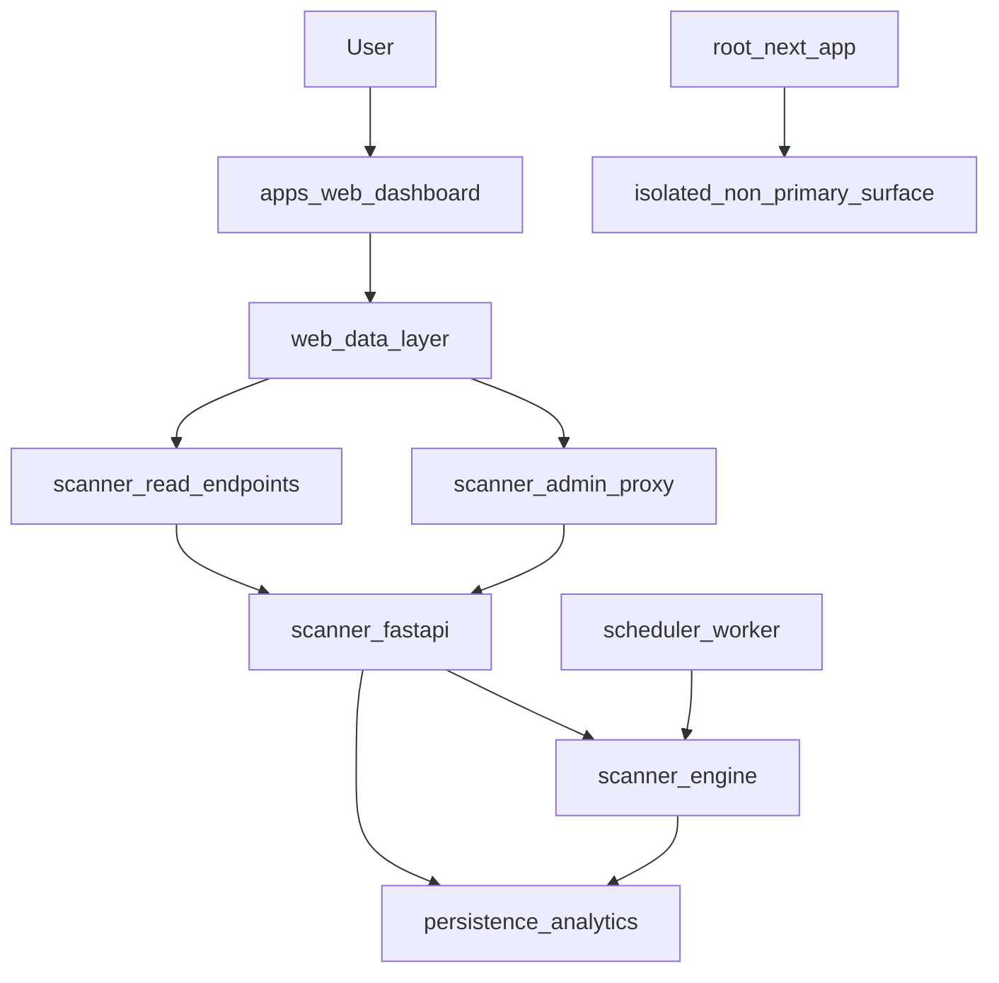

# Market Mate Scanner

This repository contains the scanner backend plus a single supported web product path. The primary product path is:

- `apps/web`: the main Market Mate Scanner dashboard
- `services/scanner`: the FastAPI scanner API, scheduler, persistence, and analytics service

The repository root Next.js app is legacy secondary UI code that is intentionally outside the supported scanner runtime path.

## Primary Product Architecture



## Primary Local Workflows

From the repository root, the default npm scripts now target the scanner dashboard in `apps/web`:

- `npm run dev`
- `npm run build`
- `npm run start`
- `npm run lint`

The legacy root UI is intentionally not exposed through top-level npm scripts. Treat it as archived-in-place code unless a future product decision explicitly revives it.

## Scanner Dashboard

Run the main dashboard directly:

```bash
cd "apps/web"
npm run dev
```

Start from `apps/web/.env.local.example` when wiring local dashboard settings.

The dashboard expects the scanner API at `NEXT_PUBLIC_SCANNER_API_BASE` and uses:

- `SCANNER_READ_API_TOKEN` for protected server-side reads
- `SCANNER_ADMIN_API_TOKEN` for journal proxy writes and optional reconciliation checks

Do not put scanner tokens in `NEXT_PUBLIC_*` variables. Only `NEXT_PUBLIC_SCANNER_API_BASE`
is exposed to the browser; `SCANNER_READ_API_TOKEN` and `SCANNER_ADMIN_API_TOKEN` are
server-side dashboard settings.

## Scanner Backend

Run the scanner service from `services/scanner` so the Python imports resolve correctly:

```bash
cd "services/scanner"
python -m uvicorn app.main:app --reload --port 8005
```

Start from `services/scanner/.env.example` when wiring local scanner settings.

## Environment And Auth Setup

Use the service template for the backend and the web template for the dashboard:

```bash
cp services/scanner/.env.example services/scanner/.env
cp apps/web/.env.local.example apps/web/.env.local
```

Do not copy backend variable names into the dashboard unchanged. The required mapping is:

- `services/scanner`: `READ_API_TOKEN` <-> `apps/web`: `SCANNER_READ_API_TOKEN`
- `services/scanner`: `ADMIN_API_TOKEN` <-> `apps/web`: `SCANNER_ADMIN_API_TOKEN`

`PUBLIC_READ_ACCESS_ENABLED` controls scanner read endpoints only:

- `PUBLIC_READ_ACCESS_ENABLED=true`: scanner read endpoints accept unauthenticated reads. This
  is convenient for local development, but not recommended for serious deployments.
- `PUBLIC_READ_ACCESS_ENABLED=false`: scanner read endpoints require a token. Set
  `READ_API_TOKEN` in `services/scanner/.env` and set the same value as
  `SCANNER_READ_API_TOKEN` in `apps/web/.env.local`.

Admin routes always require `ADMIN_API_TOKEN` on the scanner. Set the same value as
`SCANNER_ADMIN_API_TOKEN` in `apps/web/.env.local` for journal writes. Validation
reconciliation uses the admin token when present; without it, only that reconciliation
section runs in degraded mode.

The default watchlists cover ~49 US equities and ~20 crypto pairs. `WATCHLIST` and `CRYPTO_WATCHLIST` are the env vars; SPY and QQQ remain in the stock list for market-status benchmarking but are excluded from scan rows. With defaults, expect `watchlist_size` ~69 and `scan_count` ~67 (minus benchmarks and any symbols Alpaca omits). If scan duration or provider errors grow, trim the lists or lower `SCAN_CONCURRENCY_LIMIT`. See [`services/scanner/docs/operations.md`](services/scanner/docs/operations.md) for detail.

Run the worker separately:

```bash
cd "services/scanner"
python -m app.worker
```

Run backend tests from the same directory:

```bash
cd "services/scanner"
python -m unittest discover -s tests
```

Install backend dependencies before running the service or tests:

```bash
pip install -r requirements.txt
```

## Validation Commands

Primary web validation:

```bash
npm run check:web
```

Primary backend validation:

```bash
cd "services/scanner"
python -m unittest discover -s tests
```

## Trust Model

The scanner now treats these as separate concepts:

- `raw_score`: heuristic directional score from the strategy engine
- `calibrated_confidence`: evidence-adjusted operational ranking metric
- `evidence_quality`: trust label for the evidence and provider state behind a setup
- `execution_eligibility`: whether the system is willing to support action after gates and safeguards

See [`services/scanner/docs/trust-model.md`](services/scanner/docs/trust-model.md) for the explicit strategy contract, mode boundaries, and current limitations.

## Operating Documents

Use these documents as the active operating contract for the product:

- [`services/scanner/docs/product-thesis.md`](services/scanner/docs/product-thesis.md): primary product thesis and supported boundary
- [`services/scanner/docs/evidence-protocol.md`](services/scanner/docs/evidence-protocol.md): evidence rules, benchmarks, and promotion gates
- [`services/scanner/docs/paper-trading-operations.md`](services/scanner/docs/paper-trading-operations.md): paper-trading operating standard
- [`services/scanner/docs/execution-roadmap.md`](services/scanner/docs/execution-roadmap.md): leverage-ordered execution phases
- [`services/scanner/docs/scope-guardrails.md`](services/scanner/docs/scope-guardrails.md): what to cut, postpone, simplify, and keep
- [`services/scanner/docs/operations.md`](services/scanner/docs/operations.md): deployment and readiness details
- [`services/scanner/docs/trust-model.md`](services/scanner/docs/trust-model.md): trust semantics and mode boundaries

## Product Boundary

Use `apps/web` + `services/scanner` for scanner work, validation analytics, and journaling.

Treat the root Next.js app as an isolated secondary UI unless a future product decision explicitly reintegrates it.

**Do not run `next dev` from the repository root** if you want the scanner product UI; root `package.json` scripts delegate to `apps/web`, but a manual Next run at the repo root serves legacy pages.

Full environment templates: [`services/scanner/.env.example`](services/scanner/.env.example) and [`apps/web/.env.local.example`](apps/web/.env.local.example). `apps/web/.env.example` mirrors the dashboard keys for hosts that use that filename, but local Next.js development should use `apps/web/.env.local`.

### Example admin API calls

Use `Authorization: Bearer <ADMIN_API_TOKEN>` or `X-API-Key` on admin routes.

```bash
curl -X POST http://localhost:8005/scan/run -H "X-API-Key: your-admin-token"
curl -X POST http://localhost:8005/scan/scheduler/start -H "X-API-Key: your-admin-token"
curl -X POST http://localhost:8005/orders/preview \
  -H "X-API-Key: your-admin-token" -H "Content-Type: application/json" \
  -d '{"ticker":"NVDA","side":"buy","qty":1,"order_type":"market"}'
curl -X POST http://localhost:8005/orders/place \
  -H "X-API-Key: your-admin-token" -H "Content-Type: application/json" \
  -d '{"ticker":"NVDA","side":"buy","qty":1,"order_type":"market","dry_run":true,"idempotency_key":"nvda-buy-demo-0001"}'
```

## Notes
- Keep Alpaca in **paper trading** while validating behavior. The trustworthy default path is readiness, validation, replay, risk-gated previews, and dry-run/paper workflows.
- Treat the product as a **decision-support and validation system first**. Normal live trading is not the default thesis and should not be treated as the primary commercial promise yet.
- Live trading remains intentionally tiny and conservative even when enabled. The system now applies additional live caps and portfolio guardrails rather than assuming broker access means live readiness.
- Production deployments should run migrations with Alembic before starting the API and worker processes.
- Sensitive routes require `ADMIN_API_TOKEN` (`Authorization: Bearer ...` or `X-API-Key`).
