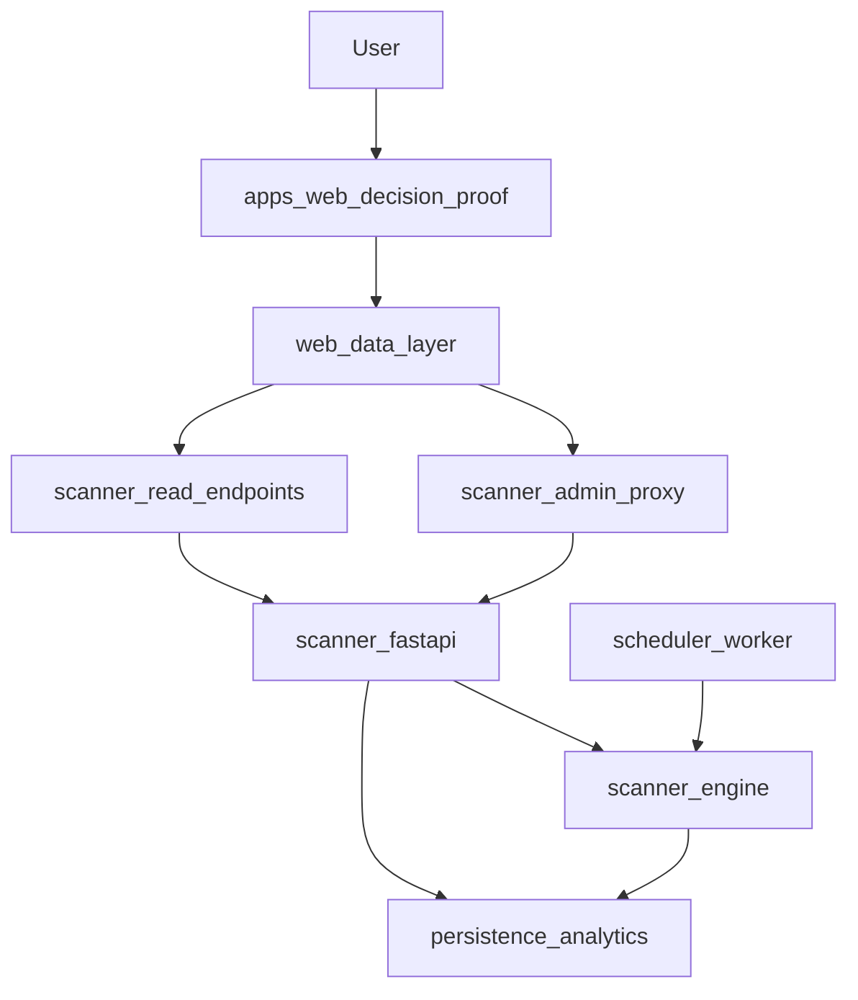

# Market Mate Scanner

This repository contains the scanner backend plus a single supported web product path. The primary product path is:

- `apps/web`: the two-page Market Mate Scanner BUY decision and proof app
- `services/scanner`: the FastAPI scanner API, scheduler, persistence, and analytics service

There is no supported repository-root Next.js app. `apps/web` is the intended and only active frontend.

## Primary Product Architecture


```mermaid
flowchart TD
    user[User] --> web[apps_web_decision_proof]
    web --> webData[web_data_layer]
    webData --> readApi[scanner_read_endpoints]
    webData --> adminProxy[scanner_admin_proxy]
    readApi --> api[scanner_fastapi]
    adminProxy --> api
    api --> scanner[scanner_engine]
    api --> persistence[persistence_analytics]
    scheduler[scheduler_worker] --> scanner
    scanner --> persistence
```

## Primary Local Workflows

From the repository root, the default npm scripts now target the scanner web app in `apps/web`:

- `npm run dev`
- `npm run build`
- `npm run start`
- `npm run lint`

Do not run `next dev` from the repository root for this product; root `package.json` delegates to `apps/web`.

## Scanner Web App

Run the two-page Decision and Proof app directly:

```bash
cd "apps/web"
npm run dev
```

Start from `apps/web/.env.local.example` when wiring local web settings.

The web app expects the scanner API at `NEXT_PUBLIC_SCANNER_API_BASE` and uses:

- `SCANNER_READ_API_TOKEN` for protected server-side reads
- `SCANNER_ADMIN_API_TOKEN` for protected scanner admin proxy actions

Do not put scanner tokens in `NEXT_PUBLIC_*` variables. Only `NEXT_PUBLIC_SCANNER_API_BASE`
is exposed to the browser; `SCANNER_READ_API_TOKEN` and `SCANNER_ADMIN_API_TOKEN` are
server-side web settings.

## Start Backend And Worker (Local)

Run these in **two separate terminals**. The API listens on `http://localhost:8005`.

**Terminal 1 - backend API** (from repo root):

```bash
cd "services/scanner"
python -m uvicorn app.main:app --reload --port 8005
```

If your prompt already ends in `.../services/scanner`, skip the `cd` and run only the `python` line.

**Terminal 2 - scheduler worker** (from repo root; auto-scans when the app scheduler is enabled):

```bash
cd "services/scanner"
python -m app.worker
```

From the repo root you can also start the worker with:

```bash
./scripts/start-worker.sh
```

On Windows PowerShell:

```powershell
powershell -File scripts/start-worker.ps1
```

Quick checks:

```bash
curl http://localhost:8005/readyz
curl http://localhost:8005/health
```

If you see `WinError 10013` or "address already in use", port 8005 is taken - usually a backend already running. Check and reuse it:

```bash
curl http://127.0.0.1:8005/health
```

On Windows, find what holds the port:

```bash
netstat -ano | findstr 8005
tasklist //FI "PID eq <pid-from-netstat>"
```

Stop the old process before starting a new one, or leave the existing server running if `/health` returns `"ok": true`.

## Local Smoke Test

After backend changes, run the temp-DB smoke path:

```bash
cd services/scanner
python -m unittest tests.test_e2e_local_smoke
```

## Scanner Backend

See [Start Backend And Worker (Local)](#start-backend-and-worker-local) for copy-paste commands. Run from `services/scanner` so Python imports resolve correctly.

Start from `services/scanner/.env.example` when wiring local scanner settings.

## Environment And Auth Setup

Use the service template for the backend and the web template for the app:

```bash
cp services/scanner/.env.example services/scanner/.env
cp apps/web/.env.local.example apps/web/.env.local
```

Do not copy backend variable names into the web app unchanged. The required mapping is:

- `services/scanner`: `READ_API_TOKEN` <-> `apps/web`: `SCANNER_READ_API_TOKEN`
- `services/scanner`: `ADMIN_API_TOKEN` <-> `apps/web`: `SCANNER_ADMIN_API_TOKEN`

`PUBLIC_READ_ACCESS_ENABLED` controls scanner read endpoints only:

- `PUBLIC_READ_ACCESS_ENABLED=true`: scanner read endpoints accept unauthenticated reads. This
  is convenient for local development, but not recommended for serious deployments.
- `PUBLIC_READ_ACCESS_ENABLED=false`: scanner read endpoints require a token. Set
  `READ_API_TOKEN` in `services/scanner/.env` and set the same value as
  `SCANNER_READ_API_TOKEN` in `apps/web/.env.local`.

Admin routes always require `ADMIN_API_TOKEN` on the scanner. Set the same value as
`SCANNER_ADMIN_API_TOKEN` in `apps/web/.env.local` for protected app actions
such as scan runs, scheduler controls, paper-order previews, dry-run paper orders,
and reconciliation checks.

Market Mate is a paper-only application. `EXECUTION_ENABLED` and
`ALLOW_LIVE_TRADING` must remain `false`; setting either to `true` causes scanner
startup to fail and does not enable broker order submission. Order placement
accepts only omitted paper defaults or `mode="dry_run"` with `dry_run=true`.

The default symbol universes cover US equities and crypto pairs. `WATCHLIST` and
`CRYPTO_WATCHLIST` are the backend env vars; SPY and QQQ remain in the stock list for
market-status benchmarking but are excluded from scan rows. If scan duration or
provider errors grow, trim the lists or lower `SCAN_CONCURRENCY_LIMIT`.

Run backend tests from the same directory:

```bash
cd "services/scanner"
python -m unittest discover -s tests
```

Install backend dependencies before running the service or tests:

```bash
pip install -r requirements.txt
```

## Verification Commands

Primary web verification:

```bash
npm --prefix apps/web test
npm --prefix apps/web run lint
npm --prefix apps/web run build
```

Primary backend verification:

```bash
cd "services/scanner"
python -m unittest tests.test_e2e_local_smoke
python -m unittest tests.test_main tests.test_risk tests.test_readiness tests.test_execution
python -m app.config_doctor
alembic current
alembic heads
alembic heads --resolve-dependencies
```

Full backend regression, when needed:

```bash
cd "services/scanner"
python -m unittest discover -s tests
```

## Trust Model

The scanner now treats these as separate concepts:

- `System Readiness`: PASS/FAIL for core backend, schema, safety, and severe data health
- `Automation`: scheduler/worker/loop state, reported separately from core system safety
- `Trade Setup Readiness`: setup quality score, not a probability that price will rise
- `Signal Evidence`: historical signal outcomes, not a future price prediction
- `Recommended Action`: PREVIEW / DRY-RUN / REVIEW / BLOCKED / IGNORE action gate
- `raw_score`: heuristic directional score from the strategy engine
- `calibrated_confidence`: evidence-adjusted operational ranking metric
- `evidence_quality`: trust label for the evidence and provider state behind a setup
- `execution_eligibility`: whether the system is willing to support action after gates and safeguards

The active web product is intentionally limited to Decision and Proof. Use the current source and tests for route behavior, evidence categories, mode boundaries, and operational limits.

## Operations runbook (local personal host)

### Wake-and-scan schedule (Windows)

Register Task Scheduler jobs once (elevated PowerShell from repo root):

```powershell
powershell -File scripts/windows/Register-ScannerTasks.ps1
```

Windows:

| Task | Local window |
|------|----------------|
| `MarketMate-Weekday-Market` | Mon–Fri ~08:12 → 16:30 |
| `MarketMate-Daily-Overnight` | Daily ~03:13 → 03:45 |
| `MarketMate-Weekend-Crypto` | Sat–Sun ~15:58 → 16:30 |
| `MarketMate-Daily-Backup` | Daily DB backup |

Health / wake checks:

```powershell
powershell -File scripts/windows/Test-ScannerHealth.ps1
powershell -File scripts/windows/Backup-ScannerDb.ps1
```

Missed expected windows are recorded in `scan_windows` and surfaced on `/system/readiness` and the Proof page live-forward panel. After downtime, the worker resolves due prediction snapshots and signal outcomes on the next wake (within expiry windows).

### Evidence campaigns

Each scan attaches predictions to an active evidence campaign (`GET /proof/campaigns`). Changing evidence-relevant config (strategy version, watchlists, gates, friction, horizons) rotates the campaign fingerprint and starts a new campaign so incompatible results never mix.

### Application completion vs real-money readiness

Finishing the app only means collection can run unattended. A small manual real-money pilot is a **later** decision based on untouched live-forward samples under one frozen campaign. See `docs/completion-report.md` for the graduation criteria. The app stays paper-only; any future orders would be placed manually at the broker.

### Operating Documents

The previous markdown operating documents under `services/scanner/docs/` were removed
during the product-slim work. Use this README, `AGENTS.md`, `docs/completion-report.md`,
and current tests/source as the operating baseline.

## Product Boundary

Use `apps/web` + `services/scanner` for BUY candidate decisions, proof analytics,
paper ledger flows, scheduler control, and manual review support.

There is no active root Next.js app to reintegrate.

**Do not run `next dev` from the repository root** if you want the scanner product
UI; use root npm scripts or `npm --prefix apps/web ...`, both of which target
`apps/web`.

Full environment templates: [`services/scanner/.env.example`](services/scanner/.env.example) and [`apps/web/.env.local.example`](apps/web/.env.local.example). `apps/web/.env.example` mirrors the web keys for hosts that use that filename, but local Next.js development should use `apps/web/.env.local`.

### Example admin API calls

Use `Authorization: Bearer <ADMIN_API_TOKEN>` or `X-API-Key` on admin routes.

```bash
curl -X POST http://localhost:8005/scan/run -H "X-API-Key: your-admin-token"
curl -X POST http://localhost:8005/scan/scheduler/start -H "X-API-Key: your-admin-token"
curl -X POST http://localhost:8005/orders/preview \
  -H "X-API-Key: your-admin-token" -H "Content-Type: application/json" \
  -d '{"ticker":"NVDA","side":"buy","qty":1,"order_type":"market"}'
curl -X POST http://localhost:8005/orders/place \
  -H "X-API-Key: your-admin-token" -H "Content-Type: application/json" \
  -d '{"ticker":"NVDA","side":"buy","qty":1,"order_type":"market","dry_run":true,"idempotency_key":"nvda-buy-demo-0001"}'
```

## Notes
- Alpaca is used for **market data only**. This build has no broker order-submission code; `EXECUTION_ENABLED` / `ALLOW_LIVE_TRADING` cannot enable it.
- Treat the product as a **decision-support and evidence-collection system**. Application completion is not real-money readiness.
- Run Alembic migrations before starting the API and worker: `cd services/scanner && alembic upgrade head`.
- Sensitive routes require `ADMIN_API_TOKEN` (`Authorization: Bearer ...` or `X-API-Key`).
